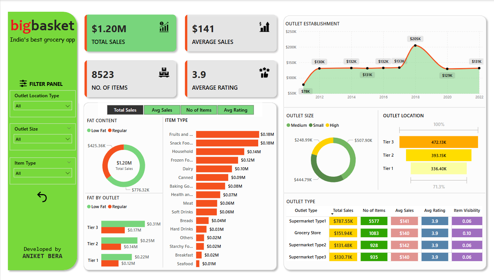

# 🛒 BigBasket Dashboard - Power BI

This repository contains a visually rich and interactive Power BI dashboard built for analyzing the performance of BigBasket’s grocery operations. It offers insights into sales, product types, outlet performance, and customer behavior through meaningful KPIs and visual charts.

---

## 📸 Dashboard Preview



---

## 📈 KPI Metrics

The dashboard tracks and summarizes the following Key Performance Indicators (KPIs):

1. **Total Sales**: The overall revenue generated from all items sold.
2. **Average Sales**: The average revenue per sale.
3. **Number of Items**: The total count of different items sold.
4. **Average Rating**: The average customer rating for items sold.

---

## 📊 Chart Visualizations

The dashboard consists of 7 dynamic chart sections designed to uncover insights:

### 1. **Total Sales by Fat Content**
- **Objective**: Analyze how fat content impacts total sales.
- **Additional KPI Metrics**: Compare Average Sales, Number of Items, and Average Rating across fat categories.
- **Chart Type**: Donut Chart

### 2. **Total Sales by Item Type**
- **Objective**: Evaluate item-type-wise sales performance.
- **Additional KPI Metrics**: Analyze how other KPIs vary by item type.
- **Chart Type**: Bar Chart

### 3. **Fat Content by Outlet for Total Sales**
- **Objective**: Compare fat content-wise total sales across different outlets.
- **Additional KPI Metrics**: View variation in KPIs across outlet-fat combinations.
- **Chart Type**: Stacked Column Chart

### 4. **Total Sales by Outlet Establishment**
- **Objective**: Examine how the age/type of outlet establishment affects sales.
- **Chart Type**: Line Chart

### 5. **Sales by Outlet Size**
- **Objective**: Study the correlation between outlet size and total sales.
- **Chart Type**: Donut/Pie Chart

### 6. **Sales by Outlet Location**
- **Objective**: Understand geographical sales patterns.
- **Chart Type**: Funnel Map

### 7. **All Metrics by Outlet Type**
- **Objective**: Display all KPIs (Total Sales, Avg Sales, Items, Ratings) for each outlet type.
- **Chart Type**: Matrix Card

---

## 🧭 Filter Panel Features

To improve interactivity and usability, the dashboard includes a custom **filter panel** with the following filters:

- ✅ **Outlet Location**
- ✅ **Outlet Type**
- ✅ **Outlet Size**
- ✅ **Item Type**

Additionally, a **Reset Button** is implemented to clear all selected filters and return to the default view.

---

## 🛠️ Tools Used

- **Power BI Desktop**
- **DAX (Data Analysis Expressions)**
- **Power Query for ETL**
- **Excel Dataset**: `Grocery Data.xlsx`

---

## 📁 File Structure

```plaintext
📁 bigbasket_dashboard/
├── bigbasket_dashboard.pbix        # Power BI dashboard file
├── Grocery Data.xlsx               # Raw data file
├── dashboard.png                   # Snapshot of the dashboard
└── README.md                       # Project documentation

---

## 📬 Contact

Created by **Aniket Bera**  
📧 Email: [aniketbera.ab@gmail.com](mailto:aniketbera.ab@gmail.com)  
🔗 LinkedIn: [linkedin.com/in/aniketbera/](https://www.linkedin.com/in/aniketbera/)  
📦 GitHub: [github.com/aniket-bera](https://github.com/aniket-bera)

---

⭐ *If you liked this dashboard, feel free to star the repository and share your feedback!*
